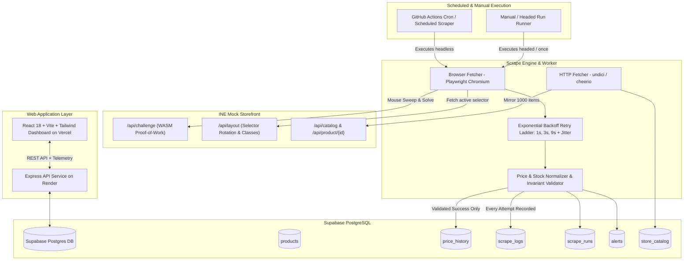
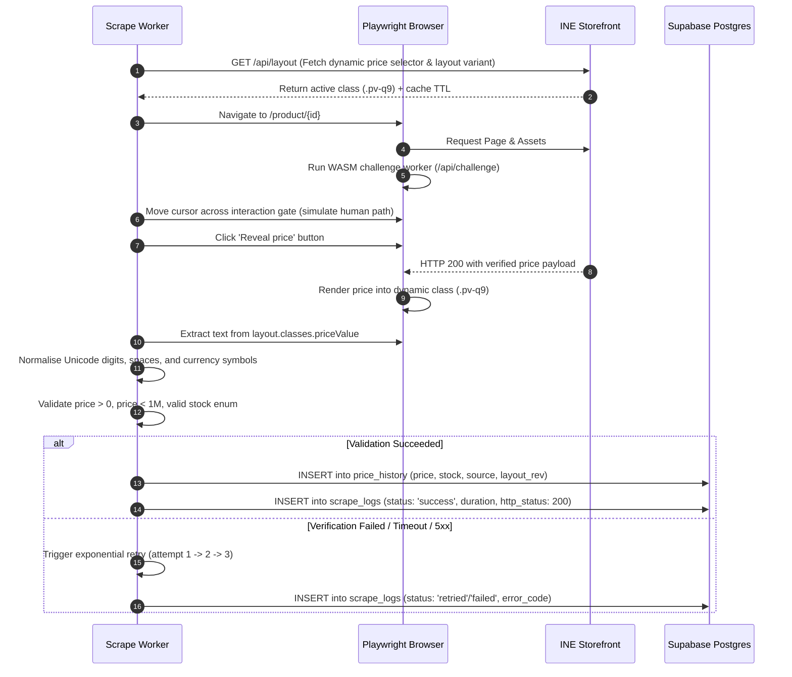
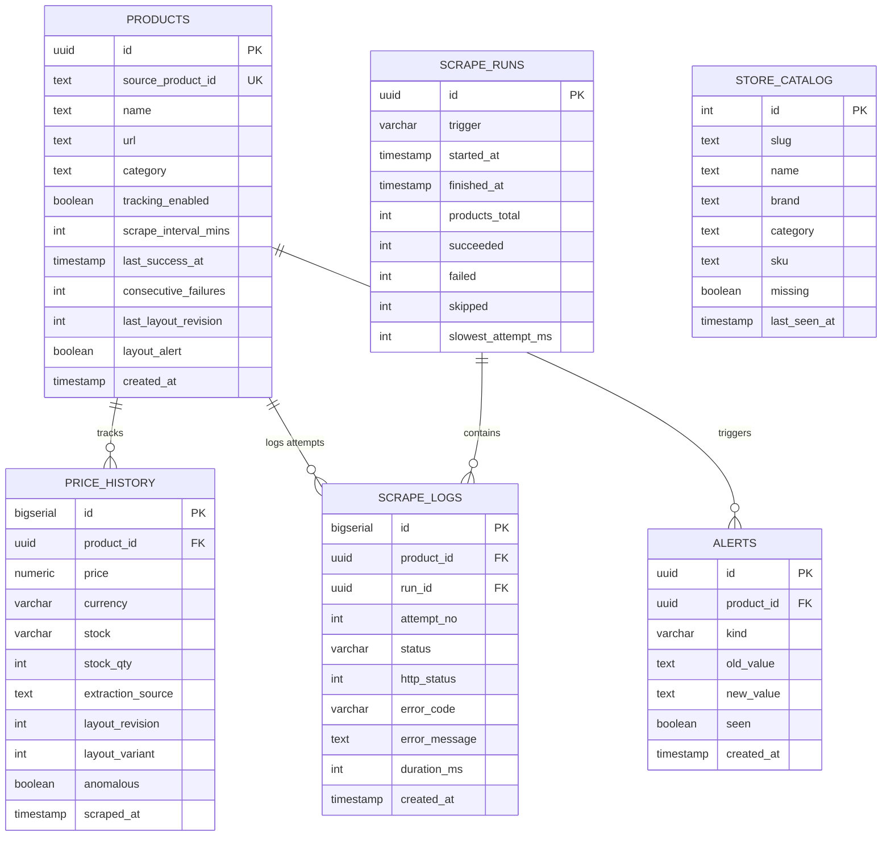

# INE Price Tracker (TrackScrape)

An automated price and stock telemetry tracker for INE's mock storefront at [demo.inelabteamdev.com](https://demo.inelabteamdev.com). Users search the store catalogue mirror, track products, and the system scrapes prices and stock status on a 2-hour cron daemon with honest per-attempt telemetry, price comparison anchoring, and alert notifications.

| Deployment | URL |
|---|---|
| **Live Frontend** | [ine-assignment.yasharth.xyz](https://ine-assignment.yasharth.xyz) |
| **Backend API** | [ine-price-tracker.onrender.com](https://ine-price-tracker.onrender.com) |
| **GitHub Repository** | [github.com/yasharth-0910/ine-price-tracker](https://github.com/yasharth-0910/ine-price-tracker) |

---

## System Architecture

TrackScrape separates catalogue and metadata discovery (lightweight plain HTTP) from the anti-bot price reveal path (automated Playwright browser).



---

## Storefront Anti-Bot Handling & Scrape Sequence

The storefront implements multiple anti-scraping defenses:
1. **WASM Proof-of-Work**: Price data sits behind an interactive WebAssembly challenge at `/api/challenge`.
2. **Mouse Interaction Gate**: The reveal button requires simulated human mouse movement across the interaction gate before activating.
3. **Rotating Decoys**: The rendered DOM contains hidden decoy elements (`.price-value`, `[data-price]`) holding wrong prices scaled by $0.6\times$ to $1.3\times$. The true price is rendered exclusively inside the dynamic class name provided by `/api/layout`.
4. **Number Formatting Variants**: Prices render across 6 randomized formats (Unicode fullwidth digits, zero-width spaces, lakh grouping, and comma separators).



---

## Database Entity Relationships



---

## Hard Invariants & Reliability Rules

1. **Clean Price History**: `price_history` receives a row only when a scrape fully succeeds and passes validation. Failed attempts write strictly to `scrape_logs` and never insert zeroes, nulls, or placeholders.
2. **Honest Per-Attempt Logging**: Every attempt is preserved. A product that succeeded on attempt 3 is distinct in the logs from one that succeeded on attempt 1.
3. **Strict Decoy Avoidance**: The parser reads only the dynamic selector defined in `/api/layout` and enforces a deny-list against `.price-value` and `[data-price]`.
4. **Idempotency & Cooldown**: A product scraped within $0.75\times$ of its interval (e.g. 90 minutes on the 2h default) is logged as `skipped_recent` to prevent duplicate writes during overlapping triggers.

---

## Local Development & Setup

### Prerequisites
- Node.js 20+
- PostgreSQL 15+ (or local database)
- Playwright Chromium browser

### 1. Database Setup
```bash
# Create local Postgres database
createdb ine_local

# Apply schema & migrations
psql -d ine_local -f db/schema.sql
for m in db/migrations/*.sql; do psql -d ine_local -f "$m"; done
```

### 2. Backend Setup
```bash
cd backend
npm install
npx playwright install chromium

# Configure environment
cp .env.example .env
# Set DATABASE_URL=postgres://localhost:5432/ine_local
# Set CRON_SECRET=your_secret
# Set CORS_ORIGINS=http://localhost:5173

# Mirror catalogue & run verification harness
npm run crawl           # Crawls store items 1..1000 into store_catalog
npm run verify:scrape   # Runs 12/12 fault-injection test suite

# Start API server
npm run dev             # Server running on http://localhost:4000
```

### 3. Frontend Setup
```bash
cd ../frontend
npm install

cp .env.example .env.local
# Set VITE_API_URL=http://localhost:4000

npm run dev             # Vite running on http://localhost:5173
```

---

## NPM Scripts

### Backend (`/backend`)
| Script | Command | Purpose |
|---|---|---|
| `npm run dev` | `tsx watch src/index.ts` | Start backend API with hot reload |
| `npm run verify:scrape` | `tsx scripts/verify-scrape.ts` | Run 12-case fault-injection harness against fake store |
| `npm run scrape:headed` | `tsx scripts/headed.ts` | Run Playwright in visible headed mode for recordings |
| `npm run scrape:cron` | `tsx scripts/scrape-cron.ts` | Run full batch scrape across all tracked products |
| `npm run crawl` | `tsx scripts/catalog-crawl.ts` | Mirror all 1,000 store catalogue items into `store_catalog` |
| `npm run typecheck` | `tsc --noEmit` | Validate backend TypeScript types |

### Frontend (`/frontend`)
| Script | Command | Purpose |
|---|---|---|
| `npm run dev` | `vite` | Start local Vite development server |
| `npm run build` | `tsc -b && vite build` | Typecheck and build production bundle |
| `npm run typecheck` | `tsc --noEmit` | Validate frontend TypeScript types |

---

## Environment Variables

### Backend
| Variable | Required | Description |
|---|---|---|
| `DATABASE_URL` | Yes | PostgreSQL connection string (`prepare: false` configured for Supabase transaction pooler). |
| `CRON_SECRET` | Yes | Shared authorization secret passed in `x-cron-secret` header. |
| `CORS_ORIGINS` | Yes | Comma-separated list of allowed frontend origins (e.g. `https://ine-assignment.yasharth.xyz`). |
| `STORE_BASE_URL` | No | Target store URL (defaults to `https://demo.inelabteamdev.com`). |
| `PORT` | No | Port for Express server (defaults to `4000`). |

### Frontend
| Variable | Required | Description |
|---|---|---|
| `VITE_API_URL` | Yes | Base URL of the backend API (e.g. `https://ine-price-tracker.onrender.com`). |

---

## Deployment Details

- **Frontend**: Deployed to Vercel via Vercel CLI (`vercel --prod`).
- **Backend API**: Deployed as a web service on Render.
- **Scheduled Scrapes**: Scheduled every 2 hours using GitHub Actions (`.github/workflows/scrape.yml`) with automated concurrency locking and direct writes to Supabase.
- **Continuous Integration**: `.github/workflows/ci.yml` runs typechecks, production builds, and the 12-case Playwright fault-injection harness on every pull request and push to `main`.
